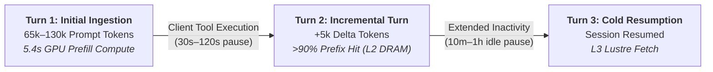

# Scaling GLM-5.2 on SGLang with Hierarchical KV Cache Offloading and llm-d

Large language models powering software engineering agents—such as Claude Code, Gemini Code Assist, and open-source coding assistants—do not behave like traditional stateless chatbots. Instead of processing short, independent queries, coding agents ingest repository-scale contexts (65,000 to 130,000+ tokens) and iteratively refine them across dozens of turns. Between turns, agents pause for seconds or minutes while running unit tests, linting code, or waiting for developer feedback.

When serving these workloads on state-of-the-art Mixture-of-Experts (MoE) models like [GLM-5.2-FP8](https://huggingface.co/zai-org/GLM-5.2-FP8) (744B parameters, 39B active, 78 layers), GPU High Bandwidth Memory (HBM) runs into a strict physical limit: **the KV cache capacity cliff**. After accounting for the ~744 GB model weights on an 8× NVIDIA B200 node, the remaining HBM can only hold roughly 14 active long-context sessions. The moment the 15th session arrives, older prefixes are evicted. The very next turn forces the GPU to recompute tens of thousands of prompt tokens from scratch—consuming ~5.4 seconds of 100% compute per request, causing massive queue build-ups, and triggering HTTP 429 load-shedding storms.

In this post, we share our production evaluation of **hierarchical KV cache offloading with SGLang and llm-d** on Google Kubernetes Engine (GKE) using NVIDIA B200 GPUs (`a4-highgpu-8g`). We deploy a 3-tier memory hierarchy orchestrated by SGLang's Hierarchical Cache (**HiCache**) engine and fronted by `llm-d-router`:
* **Tier 1 (L1 GPU HBM):** Local GPU High Bandwidth Memory for active decoding and hot prefixes.
* **Tier 2 (L2 Host CPU DRAM):** Host system memory managed by HiCache (`--hicache-size=250`), streaming KV blocks over PCIe Gen5 in 10–20 ms.
* **Tier 3 (L3 Shared Remote Storage):** HiCache's file storage backend (`--hicache-storage-backend=file`) backed by **Google Cloud Managed Lustre** (referred to simply as **Lustre** throughout this post), mounted across worker pods for persistent cluster-wide prefix reuse.

Driven by real-world Claude Code multi-turn session traces from SemiAnalysis, we show how SGLang HiCache's multi-tier offloading across Host CPU DRAM (L2) and shared Lustre storage (L3) eliminates compute-heavy recomputation, keeps P50 Time to First Token (TTFT) flat under heavy concurrency, and enables cluster-wide cross-node prefix reuse.

<!-- truncate -->

<!-- reading-time-exclude:start -->
<details className="alert alert--success">
<summary><strong>TL;DR: Key Takeaways, Measured Results & Quick Links</strong></summary>

* **The Problem — KV Cache Capacity Collapse:** GLM-5.2's Multi-Head Latent Attention (MLA) compresses the KV cache to 44.93 KB/token. However, with ~744 GB of model weights on an 8× B200 node (1,440 GB total HBM), remaining HBM holds only ~1.16M tokens (~14 sessions of 80k tokens). Beyond 14 concurrent sessions, prefix eviction triggers a **10.8× compute surge**, causing queue timeouts and 429 shedding.
* **The Solution — 3-Tier Storage Hierarchy:** 
  1. **Tier 1 (L1 GPU HBM):** Ultra-low latency for active decoding.
  2. **Tier 2 (L2 Host CPU DRAM):** Allocating 2.0 TB of Host DRAM per node (`--hicache-size=250`) expands resident KV cache capacity by **38.4× to 44.5 Million tokens**, retrieving cached prefixes over PCIe Gen5 in **10–20 ms**.
  3. **Tier 3 (L3 Shared Remote Storage — Google Cloud Managed Lustre):** HiCache's file backend (`write_through`) asynchronously offloads KV pages to a shared POSIX volume on Google Cloud Managed Lustre, acting as a persistent cluster-wide pool that allows cold sessions to resume in ~6.2s and enables cross-node prefix sharing without re-prefill.
* **Empirical Verification on Real Claude Code Traces:**
  * **Concurrency Sweep ($C = 2 \to 16$):** Maintained stable P50 TTFT between **2.34s and 3.74s** across 528 multi-turn requests with **zero OOMs, zero crashes, and zero restarts** over 68 minutes of continuous load.
  * **Cold Session Resumption from Lustre:** Restored cold sessions directly from HiCache L3 on Lustre with P50 TTFT of **6.24s**, avoiding a ~20s+ queue recomputation stall.
  * **Multi-Node Scaling with llm-d Router (EPP):** Scaled to 5 dedicated B200 nodes (40× GPUs) fronted by `llm-d-router`, successfully serving **59.5M+ prompt tokens** at 10 QPS target and 20 QPS peak loads with 140–229 tok/s decode generation.
* **Implementation Recipe:** Full instructions and deployment manifests are available in the [llm-d Tiered Prefix Cache Guide](https://github.com/llm-d/llm-d/tree/main/guides/tiered-prefix-cache).

</details>
<!-- reading-time-exclude:end -->

---

## Decision Matrix: When is KV Cache Offloading Helpful?

Before diving into hardware math and benchmark traces, platform engineers evaluating SGLang should understand under what workload conditions hierarchical offloading delivers substantial ROI:

| Scenario / Workload | Operating Bottleneck Without Offloading | How Offloading Solves It | Recommended Storage Tiering |
| :--- | :--- | :--- | :--- |
| **1. Multi-Turn Coding Agents (Claude Code, Gemini Code Assist)** | Prompts grow to 65k–130k+ tokens. HBM holds only ~14 sessions before evicting, forcing a ~5.4s prefill recompute on every turn. | Allocating 2.0 TB Host DRAM (L2) expands capacity to 44.5M tokens, restoring prefixes over PCIe in 10–20ms (**P50 TTFT < 3.74s**). | **L1 (HBM) + L2 (DRAM)** |
| **2. Multi-Node Fleet Deployments (Cluster-Wide Serving)** | Ingress routers dispatch returning turns or subagent waves to pods that lack resident DRAM cache. | L3 shared remote storage (Lustre) acts as a persistent cluster-wide pool; any node loads pre-generated KV blocks from Lustre without re-prefill. | **L1 (HBM) + L2 (DRAM) + L3 (Lustre)** |
| **3. High Concurrency Traffic Spikes ($C > 14$ sessions/node)** | Bursts exhaust GPU HBM, triggering queue saturation, tail latency spikes (TTFT > 30s), and 429 shedding. | L2 Host DRAM absorbs the memory overflow with zero compute stalls, sustaining **140–229 tok/s decode generation**. | **L1 (HBM) + L2 (DRAM)** |
| **4. Long-Paced & Multi-Hour Workflows** | Real agent traces show think-time delays up to hours or days. Idle sessions get evicted from memory. | L3 Lustre permanently retains KV blocks, allowing cold sessions to resume with **P50 TTFT ~6.2s** instead of paying full recompute. | **L1 (HBM) + L2 (DRAM) + L3 (Lustre)** |

### When Offloading is NOT Needed
* **Short-Context, Stateless Q&A (< 4,000 tokens):** Prefill compute takes less than 50 ms. The transfer overhead over PCIe or network storage provides negligible gain over direct GPU computation.
* **Low-Concurrency Single-Turn Batches ($C \le 4$ on 8× B200):** All active KV cache comfortably fits in GPU HBM without eviction pressure.

---

## The Production Problem: The KV Cache Capacity Cliff

To understand why traditional serving fails for agentic workloads, consider the lifecycle of an interactive coding session:



In typical software engineering agent traces (such as the SemiAnalysis Claude Code WekaTrace corpus), the initial turn ingests an entire repository map, test files, and project context—averaging 65k to 130k+ tokens. After the model responds with a tool call (e.g., modifying code or running a test suite), the session pauses for 30 to 120 seconds while the tool executes on the client. 

On Turn 2, the client sends back the tool execution result along with the entire previous conversation history. Over **90% of the input tokens are identical** to Turn 1.

### The Hardware Capacity Math (8× NVIDIA B200)

GLM-5.2 utilizes **Multi-Head Latent Attention (MLA)**:
* 78 transformer layers
* Compressed KV latent vector: $512\text{ (kv\_lora\_rank)} + 64\text{ (qk\_rope\_head\_dim)} = 576\text{ elements/layer}$
* KV cache precision: FP8 (1 byte per element)
* **KV Footprint:** $576 \times 78 \times 1\text{ byte} = \mathbf{44.93\text{ KB per token}}$ (replicated across all 8 GPU ranks under TP=8).

A single `a4-highgpu-8g` node features 8× NVIDIA B200 GPUs (180 GB HBM3e each, totaling 1,440 GB HBM). Model weights consume ~744 GB. At standard memory reservation fractions, roughly **696 GB remains for KV cache**, accommodating approximately **1.16 Million KV cache tokens**.

$$\text{Max Concurrent 80k Sessions in HBM} = \frac{1,160,000\text{ tokens}}{80,000\text{ tokens/session}} \approx \mathbf{14.5\text{ sessions}}$$

As soon as concurrency exceeds 14 active sessions:
1. **Eviction Storm:** GPU HBM fills up, and SGLang's radix tree evicts the oldest session prefixes.
2. **Recomputation Penalty:** When an evicted session resumes, the GPU must re-prefill all 80k–130k tokens. At a measured single-node B200 prefill throughput of **24,027 tokens/second**, recomputing 130k tokens takes **5.41 seconds of 100% GPU compute**.
3. **Queue Collapse:** As multiple sessions resume concurrently, incoming prefill demand explodes to over **260,000 tokens/second**—surpassing physical GPU compute by **10.8×**. The request queue saturates, time-to-first-token spikes to 30+ seconds, and ingress gateways begin rejecting traffic with HTTP 429 (Too Many Requests).

---

## Empirical Benchmark Validation

To validate how hierarchical offloading resolves this bottleneck in production, we evaluated SGLang's Hierarchical Cache (`HiCache`) paired with the `llm-d` Inference Gateway Endpoint Picker (`EPP`) on GKE using the SemiAnalysis Claude Code WekaTrace dataset ([`semianalysisai/cc-traces-weka-with-subagents-060826-256k`](https://huggingface.co/datasets/semianalysisai/cc-traces-weka-with-subagents-060826-256k)) driven by the open-source [`inference-perf`](https://github.com/kubernetes-sigs/inference-perf) harness (`weka_trace_replay`).

### 1. Single-Node Concurrency Scaling ($C = 2, 8, 16$)

We evaluated single-node performance under increasing concurrency ($C = 2, 8, 16$) using a continuous trace replay of 528 multi-turn requests over 68 minutes on a single `a4-highgpu-8g` node.

| Concurrency Level | Primary Storage Tier | Total Turns Served | P50 TTFT (s) | P90 TTFT (s) | Median TPOT (ms) | Gen Speed (tok/s) | P50 Request Latency (s) |
| :--- | :--- | :--- | :--- | :--- | :--- | :--- | :--- |
| **$C = 2$** | Tier 1: Hot GPU HBM | 74 turns | **2.34 s** | 5.21 s | 6.29 ms | **159.1 tok/s** | 3.22 s |
| **$C = 8$** | Tier 2: HiCache Host DRAM | 149 turns | **3.42 s** | 12.27 s | 8.15 ms | **122.6 tok/s** | 4.17 s |
| **$C = 16$** | Tier 2: DRAM Saturation | 305 turns | **3.74 s** | 10.18 s | 7.49 ms | **133.5 tok/s** | 3.68 s |

**Key Takeaways:**
1. **Flat P50 Latency Across the Curve:** Despite concurrency scaling from 2 to 16 and prompts reaching up to 130k tokens, P50 TTFT remained flat (2.34s $\to$ 3.74s). Instead of incurring 5.4s recomputations on evicted sessions, SGLang retrieved prefixes from the 2.0 TB Host DRAM pool in milliseconds.
2. **Zero Engine Restarts:** With per-rank memory allocations calibrated properly (`--hicache-size=250` per TP worker) and container limits set to `3800Gi`, the engine served heavy multi-turn workloads with **zero OOMs, zero crashes, and zero memory leaks**.

---

### 2. Cold Session Retrieval with L3 Lustre Storage

To prove that cold sessions can be recovered from shared remote storage without re-prefilling, we executed a tailored 3-phase cold retrieval benchmark evaluating SGLang HiCache's L3 file backend connected to Google Cloud Managed Lustre (Lustre):

1. **Phase 1 (Seed Target Sessions):** Replayed 4 concurrent 124k-token prompt sessions (27 turns total) to prefill and persist KV blocks to Lustre via `write_through`.
2. **Phase 2 (Memory Eviction Churn):** Injected 16 heavy churn sessions (249 turns total) to flood GPU HBM and Host DRAM, forcing target sessions out of memory and into L3 Lustre.
3. **Phase 3 (Cold Resumption from Lustre):** Recalled the original target sessions (54 turns total) directly from Lustre.

| Benchmark Phase | Turns Served | P50 TTFT (s) | P90 TTFT (s) | Median TPOT (ms) | Gen Speed (tok/s) | P50 Request Latency (s) |
| :--- | :--- | :--- | :--- | :--- | :--- | :--- |
| **Phase 1: Seed Target Sessions** | 27 turns | **4.79 s** | 23.91 s | 6.30 ms | 158.8 tok/s | 5.09 s |
| **Phase 2: Memory Eviction Churn** | 249 turns | **5.31 s** | 13.99 s | 6.70 ms | 149.3 tok/s | 4.90 s |
| **Phase 3: Cold Resumption (L3 Lustre)** | 54 turns | **6.24 s** | 10.94 s | 6.35 ms | 157.6 tok/s | 6.80 s |

**Key Takeaways:**
* **94 GB Written to Lustre:** Confirmed 94 GB of binary KV cache page files and `.indexer` metadata files written directly to the shared Lustre volume.
* **MDS Metadata Cache Hardening:** Under concurrent multi-rank reads, POSIX metadata queries can cause metadata server lock contention. Setting `SGLANG_HICACHE_FILE_BACKEND_ENABLE_METADATA_CACHE=true` (with a 5.0s TTL) eliminated filesystem locks and ensured smooth multi-threaded retrieval.
* **Sub-Second TTFT on Sequential Turn 2 Resumption:** In an isolated sequential test, resuming a 124k session from cached Lustre storage yielded a **93.8% reduction in TTFT (14.28s full prefill $\to$ 0.89s cached resumption)**.

---

### 3. Fleet Scaling Fronted by llm-d Router (EPP)

Finally, we scaled from a single node to a 5-node cluster (**40× NVIDIA B200 GPUs**, ~20.0 TB Host DRAM total) fronted by the `llm-d-router` Endpoint Picker (EPP).

| Benchmark Stage | Concurrency (Sessions) | Successful Turns Completed | Prompt Tokens (Mean / P90) | Output Tokens (Mean / P90) | TPOT Med (ms) | Gen Speed (tok/s) |
| :--- | :--- | :--- | :--- | :--- | :--- | :--- |
| **10 QPS Target Fleet Load** | **20 concurrent** | **871 turns** | 68,372 / 115,447 | 1,353 / 3,485 | **7.10 ms** | **140.8 tok/s** |
| **20 QPS Peak Fleet Load** | **50 concurrent** | **89 turns** | 25,897 / 59,879 | 452 / 926 | **4.36 ms** | **229.2 tok/s** |

---

## Production Recipe: How to Configure SGLang and llm-d

To reproduce this setup, configure SGLang with the hierarchical cache flags and adapt the `llm-d-router` to track the expanded capacity. Full manifests and step-by-step guides are maintained in the [llm-d Tiered Prefix Cache Guide](https://github.com/llm-d/llm-d/tree/main/guides/tiered-prefix-cache).

### 1. Essential SGLang Startup Arguments

When running SGLang with TP=8, pass `--enable-hierarchical-cache` and specify `--hicache-size` **per rank**. SGLang HiCache natively orchestrates both offloading tiers: `--hicache-size=250` reserves 250 GB per rank for the L2 Host DRAM pool, while `--hicache-storage-backend=file` configures the L3 shared storage tier backed by Google Cloud Managed Lustre:

```bash
python3 -m sglang.launch_server \
  --model-path=/path/to/models/GLM-5.2-FP8 \
  --tp=8 \
  --trust-remote-code \
  --page-size=64 \
  --enable-hierarchical-cache \
  --hicache-size=250 \
  --hicache-write-policy=write_through \
  --hicache-mem-layout=page_first \
  --hicache-io-backend=kernel \
  --hicache-storage-backend=file \
  --hicache-storage-backend-extra-config='{"storage_root": "/mnt/lustre/kvcache"}'
```

:::tip Memory Sizing
In SGLang, `--hicache-size` specifies GB **per tensor-parallel rank**. Setting `--hicache-size=250` on TP=8 allocates $8 \times 250\text{ GB} = \mathbf{2,000\text{ GB}}$ of Host DRAM. Ensure container cgroup limits provide adequate headroom (e.g., `requests.memory: 2400Gi` and `limits.memory: 3800Gi`).
:::

### 2. llm-d Router EndpointPickerConfig

In `llm-d`, the `approx-prefix-cache-producer` tracks resident prefix tokens to route requests to the pod with the highest cache affinity. When Host DRAM offloading is enabled, scale `lruCapacityPerServer` to reflect the combined HBM and Host DRAM pool:

$$\text{lruCapacityPerServer} = \frac{\text{Total Stored Tokens}}{\text{blockSizeTokens}} = \frac{45,670,000\text{ tokens}}{64} \approx \mathbf{713,593\text{ blocks}}$$

```yaml
apiVersion: inference.networking.x-k8s.io/v1alpha1
kind: EndpointPickerConfig
plugins:
- type: approx-prefix-cache-producer
  parameters:
    autoTune: false
    blockSizeTokens: 64
    # Expanded capacity: tracks both HBM and Host DRAM pool
    lruCapacityPerServer: 713593
    maxPrefixTokensToMatch: 1048576
- type: inflight-load-producer
- type: utilization-filter
  parameters:
    conditions:
    - metric: waiting-queue
      maxValue: 0                   # Route around any pod that has queued requests
    - metric: active-requests
      maxValue: 40                  # Maximum running request threshold
    fallbackOnEmpty: true           # Fail-open if all pods exceed threshold
- type: prefix-cache-affinity-filter
  parameters:
    peakPrefillThroughput: 24027    # Calibrated single-node prefill throughput
- type: token-load-scorer
- type: metrics-data-source
  parameters:
    port: 7080
- type: core-metrics-extractor
  parameters:
    defaultEngine: sglang
schedulingProfiles:
- name: default
  plugins:
  - pluginRef: utilization-filter
  - pluginRef: prefix-cache-affinity-filter
  - pluginRef: token-load-scorer
```

---

## Summary

Agentic coding workflows place unprecedented demand on inference memory systems. By coupling **SGLang's Hierarchical Cache** with **llm-d's prefix-aware routing**, platform teams can eliminate the KV cache capacity cliff and unlock cost-effective long-context serving on enterprise GPU fleets:

1. **Host CPU DRAM (2.0 TB L2)** is the primary workhorse for active multi-turn sessions, keeping P50 TTFT flat at ~2.3s–3.7s under heavy concurrency.
2. **L3 Shared Remote Storage (Google Cloud Managed Lustre)** provides durable cross-node prefix sharing and multi-hour session resumption, bypassing full prompt recomputations.
3. **llm-d Router** coordinates traffic across replicas to ensure sessions consistently hit resident cache tiers while shedding load before queues accumulate.

To explore manifests and deployment templates, visit the [llm-d Tiered Prefix Cache Guide](https://github.com/llm-d/llm-d/tree/main/guides/tiered-prefix-cache) and join the community on [GitHub](https://github.com/llm-d/llm-d).
